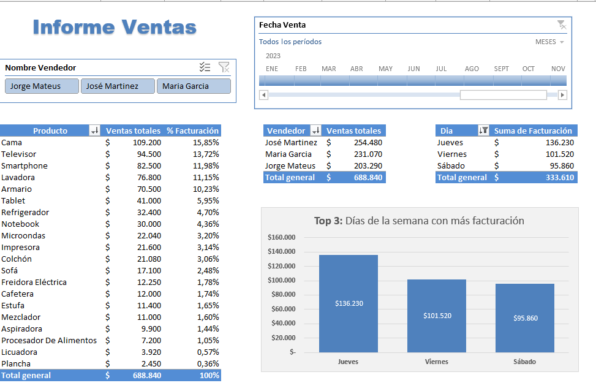
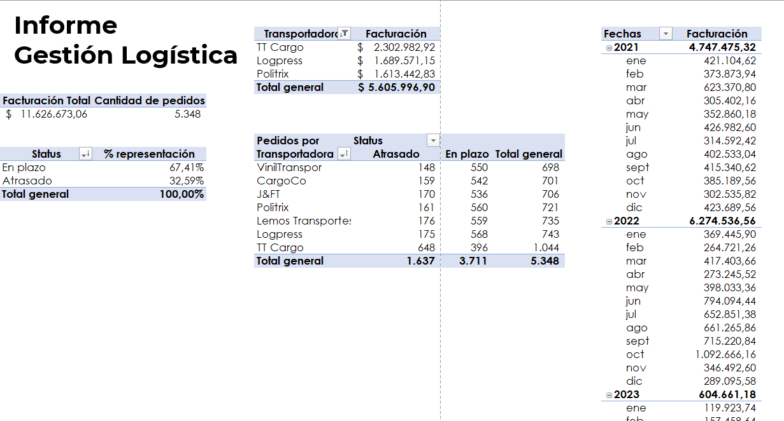
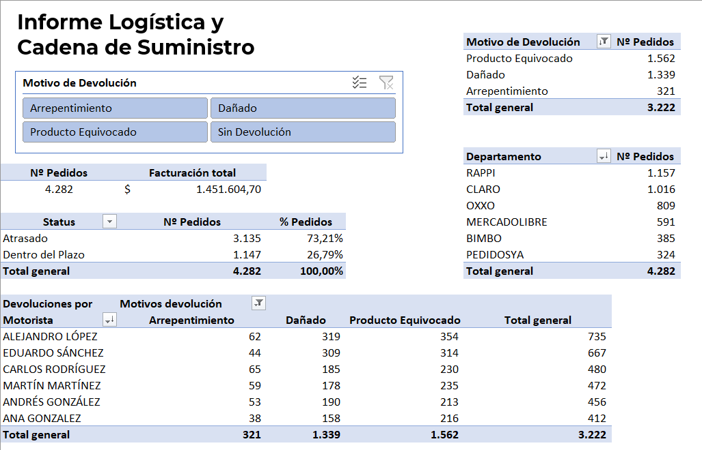
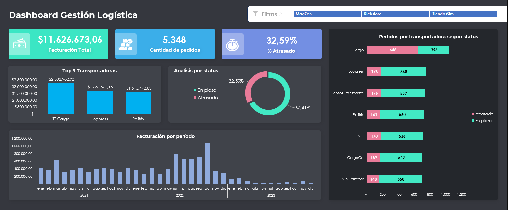
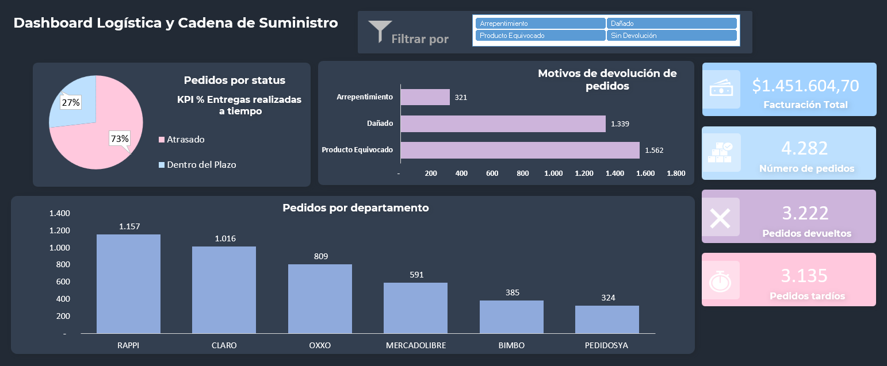

# Automatizaciones, Tablas dinámicas y Dashboards en Excel.

Bases de datos automatizadas, informes con tablas dinámicas y dashboards implementados en Excel.

Estas herramientas nos ayudan a analizar grandes conjuntos de datos de manera rápida, clara y eficiente mediante tablas, gráficos, KPIs y otros elementos, con el objetivo de tomar decisiones estratégicas en el mundo del análisis de datos.

## Informes

### Informe de una base de datos de Ventas

### Informe de una base de datos de Envios 

### Informe de una base de datos de Logística y Cadena de Suministro

## Dashboards

### Dashboard Gestión Logística

### Dashboard Logística y Cadena de Suministro

- Bases de datos provenientes del curso de Excel de Empowerdata
